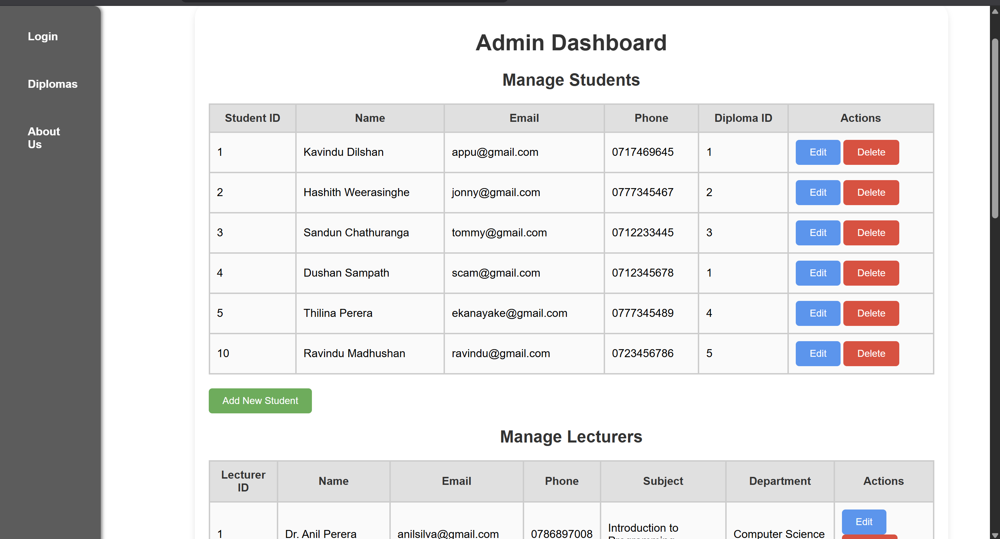
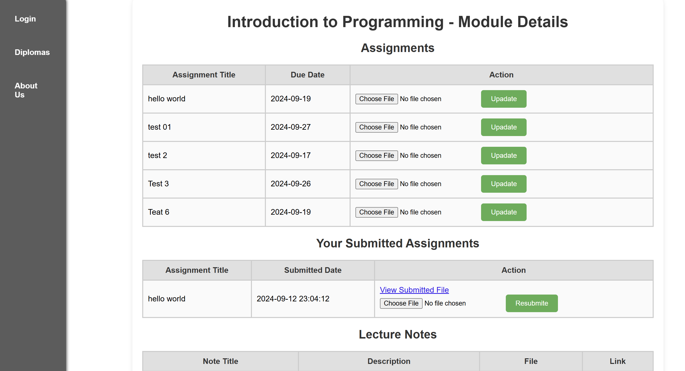
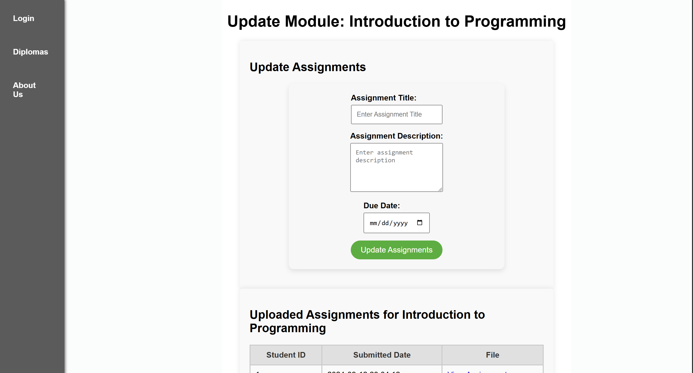

# 📚 Institute LMS (Learning Management System)

A PHP & MySQL-based Learning Management System designed for educational institutes. It supports three different roles: **Admin**, **Lecturer**, and **Student**. This project provides core LMS functionality such as assignment submission, timetable management, and user management.

---

## 🚀 Features

### 🔐 Authentication
- Single login page with role-based redirection (Admin, Lecturer, Student).
- Session-based login system.

### 👨‍🎓 Student Dashboard
- View personal details.
- Select and view modules.
- Upload assignments to lecturers.

### 👨‍🏫 Lecturer Dashboard
- View assigned students.
- Download student assignments.
- Upload assignment feedback or marks.

### 🛠️ Admin Dashboard
- Add and manage users (students, lecturers).
- Add timetables for courses.
- View system usage.


---


## 🧪 How to Run the Project

1. **Clone or Download** this repository to your `htdocs` directory in XAMPP.
   ```bash
   C:\xampp\htdocs\institute_project

## 📷 Screenshots

### 🔐 Admin Dashboard  


### 👨‍🎓 Student Dashboard  


### 🛠️ Lecturer Dashbord  



